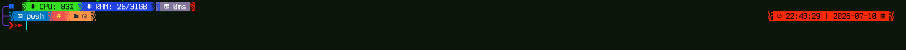

# Super Merged Oh My Posh Theme

A custom, highly pixelated digital Oh My Posh theme merging elements of Agnoster, Atomic, and If_Tea, featuring sharp red digital powerline edges, live system resources, and command-level timestamps.



## Features
- **Digital Powerlines**: Custom right-and-left pixelated borders transitioning seamlessly.
- **Standalone Time Ribbon**: A red timestamp ribbon dynamically placed on the right.
- **Command Timestamps**: Every command is permanently stamped on execution.
- **System Specs**: Real-time CPU and RAM tracking.
- **Git Integration**: Full git status including ahead/behind, branch name, and changes.

## Installation

1. Ensure you have [Oh My Posh](https://ohmyposh.dev/) installed.
2. Ensure you have a **Nerd Font** installed and set as your terminal font (e.g., `Terminess Nerd Font`).
3. Download the `super_merged_theme.omp.json` file from this repository.
4. Place it in your Oh My Posh themes folder (or any directory you prefer).
5. Open your PowerShell profile by running `notepad $PROFILE`.
6. Add or update the Oh My Posh initialization line to point to the theme:
   ```powershell
   oh-my-posh init pwsh --config 'C:\path\to\super_merged_theme.omp.json' | Invoke-Expression
   ```
   *(Make sure to replace `C:\path\to\...` with the actual path where you saved the file)*
7. Restart your terminal!
